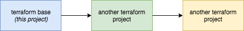

# Terraform Base - with remote backends and workspaces

The idea behind the Terraform base project is it is the project everything else stems from. For example, this is where you would setup AWS VPC's and subnets.

In this particular version it is much simpler as Terraform does not manage the VPC's so we are just setting up fairly trivial infrastructure such as an internal Route53 zone.

### Architecture



These examples uses both a remote backend combined with workspaces. A more detailed blog post can be found [here](https://medium.com/@brendanspinks/terraform-on-aws-using-remote-state-backends-with-workspaces-7e0f2f341b2b).

# Setting up our backend

First up, we store all our Terraform state in AWS S3, there are a few different options for this, please see the Terraform docs for more info.

>Workspaces can also use multiple AWS accounts, however the backend itself should always use the same account.

Ensure that you have created the S3 Bucket referenced by the `-backend-config="bucket=` parameter before running the following.

```sh
terraform init -backend-config="access_key=somekey" -backend-config="secret_key=somesecret" -backend-config="region=ap-southeast-2" -backend-config="bucket=foo-bar" -backend-config="key=base"
```

This will update Terraforms configuration to always push our state to S3, in the example the bucket used is `foo-bar`.

# Setting up our workspace

Setting up a workspace is very straight forward.

```sh
terraform workspace new example
```

You should see the following.

```sh
Created and switched to workspace "example"!
```

# Setting up our infrastructure

I have been using AWS profiles to manage account secrets, there are a few options available. AWS profiles are fairly simple.

The only niggly issue at the moment with this setup are 'workspace' variables. These are workspace specific configurations. In this simple example we only have two, `zone_name` and the `vpc-id`. I am still using a file for consitancy as subsequent projects are more complex.

In this example I have workspace variables in the `workspace-variables` directory.

```sh
terraform plan -var aws_profile=example -var-file=workspace-variables/example.tfvars
```

If this all works as expected with no errors you can then apply the changes.

```
terraform plan -var aws_profile=example -var-file=workspace-variables/example.tfvars
```

You should see something like the following:

```sh
Apply complete! Resources: 1 added, 0 changed, 0 destroyed.
```

The state of the workspace should also be available on S3, go to the bucket created, you should see an `env:` directory, within it you should see a folder with your workspace name, in that folder there should be a state file with the name of the project, in this case `base`.

